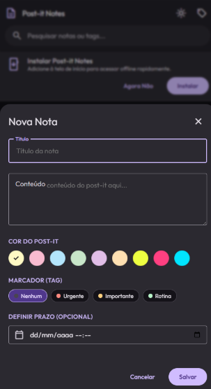
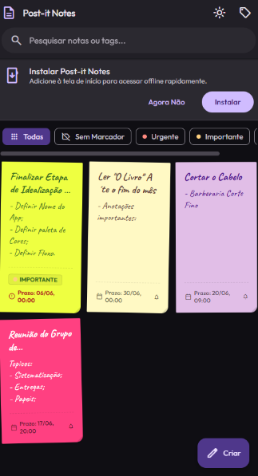
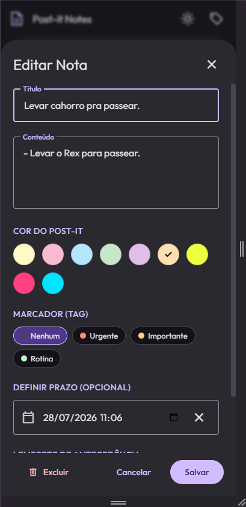
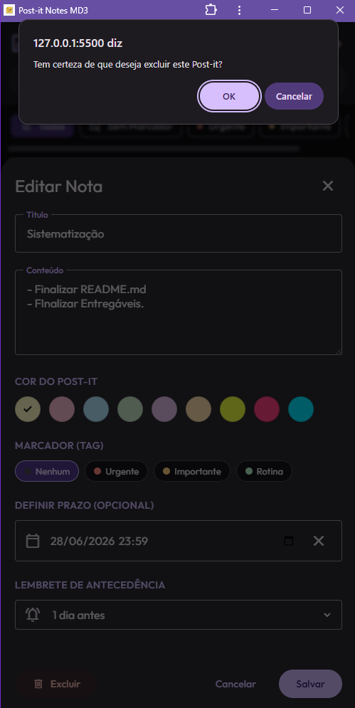

# 🗒️ Post It Notes

> *Notes* de anotações + *Post-it* = **Post It Notes** — um app de notas digitais que traz a praticidade e o charme dos post-its físicos para o ambiente web, com suporte a modo claro, modo escuro e funcionalidades PWA.

---

## 🎨 Paleta de Cores

As cores do Post It Notes foram escolhidas para refletir os **post-its do mundo real**, combinando autenticidade com uma experiência visual sofisticada em ambos os temas.

### 🌞 Tema Claro

| Papel | Cor | Hex |
|---|---|---|
| Primary | Lilás profundo | `#6750A4` |
| Primary Container | Lavanda suave | `#EADDFF` |
| Surface | Off-white puro | `#FEF7FF` |
| Background | Azul-acinzentado claro | `#F7F9FC` |
| On Surface | Quase preto | `#1D1B20` |

A superfície clara remete ao papel branco dos post-its tradicionais, enquanto o lilás como cor primária traz personalidade sem poluir visualmente.

### 🌙 Tema Escuro

| Papel | Cor | Hex |
|---|---|---|
| Primary | Lilás luminoso | `#D0BCFF` |
| Primary Container | Roxo médio | `#4F378B` |
| Surface | Quase preto | `#141218` |
| Background | Preto profundo | `#0F0E13` |
| On Surface | Cinza claro | `#E6E1E9` |

No tema escuro, as cores dos post-its ficam ainda mais vibrantes e se destacam sobre o fundo escuro — como um mural de notas iluminado à noite.

### 🎨 Cores dos Post-its (Cards)

As cores dos cards foram inspiradas diretamente nos post-its físicos mais populares do mercado:

| Tag padrão | Cor | Hex |
|---|---|---|
| Urgente 🔴 | Rosa-coral | `#FF8A80` |
| Importante 🟡 | Âmbar suave | `#FFD180` |
| Rotina 🟢 | Verde-menta | `#B9F6CA` |
| Padrão ✏️ | Amarelo post-it | `#FFF9C4` |

---

## ✨ Funcionalidades CRUD

O Post It Notes implementa as 4 operações fundamentais de banco de dados (**Create, Read, Update, Delete**) para notas e marcadores (tags).

---

### 📝 Create — Criar Nota

Cria uma nova nota com título, conteúdo, cor personalizada, tag e data de vencimento opcional.

**Endpoint:** `POST /api/notes`

```json
{
  "id": "note-uuid",
  "title": "Minha Nota",
  "content": "Conteúdo da nota aqui.",
  "color": "#FFF9C4",
  "tagId": "tag-urgent",
  "dueDate": "2025-12-31",
  "reminderMinutes": "30"
}
```



### 📖 Read — Listar Notas

Recupera todas as notas salvas, ordenadas da mais recente para a mais antiga.

**Endpoint:** `GET /api/notes`

```json
[
  {
    "id": "note-uuid",
    "title": "Minha Nota",
    "content": "Conteúdo da nota aqui.",
    "color": "#FFF9C4",
    "tagId": "tag-urgent",
    "createdAt": "2025-06-27 18:00:00",
    "updatedAt": "2025-06-27 18:00:00"
  }
]
```



### ✏️ Update — Editar Nota

Atualiza o conteúdo, título, cor, tag ou data de vencimento de uma nota existente. O campo `updated_at` é atualizado automaticamente.

**Endpoint:** `PUT /api/notes/:id`

```json
{
  "title": "Nota Atualizada",
  "content": "Novo conteúdo.",
  "color": "#FFD180",
  "tagId": "tag-important"
}
```



---

### 🗑️ Delete — Excluir Nota

Remove uma nota permanentemente pelo seu ID.

**Endpoint:** `DELETE /api/notes/:id`

```
DELETE /api/notes/note-uuid
→ 200 OK:       { "success": true, "id": "note-uuid" }
→ 404 Not Found: { "error": "Nota não encontrada." }
```



---

## 🚀 Como Rodar Localmente

### Pré-requisitos

- [Node.js](https://nodejs.org/) v20 LTS (recomendado)
- `npm` (incluso com o Node.js)
- Windows: [Visual Studio Build Tools](https://visualstudio.microsoft.com/pt-br/visual-cpp-build-tools/) com a opção **"Desenvolvimento para Desktop com C++"** (necessário para compilar o `better-sqlite3`)

### Instalação

```bash
# Clone o repositório
git clone https://github.com/bluegrimm14/sistematizacao_pdm.git
cd sistematizacao_pdm

# Instale as dependências
npm install

# Inicie o servidor
npm start
```

O app estará disponível em: **http://localhost:3000**

---

## 🗄️ Banco de Dados

O Post It Notes usa **SQLite** via `better-sqlite3`. O arquivo do banco (`postit.db`) é criado automaticamente na pasta `server/` ao rodar o servidor pela primeira vez.

### Tabelas

```sql
-- Marcadores (Tags)
CREATE TABLE tags (
  id    TEXT PRIMARY KEY,
  name  TEXT NOT NULL UNIQUE,
  color TEXT NOT NULL
);

-- Notas
CREATE TABLE notes (
  id                 TEXT PRIMARY KEY,
  title              TEXT NOT NULL,
  content            TEXT NOT NULL,
  color              TEXT NOT NULL DEFAULT '#FFF9C4',
  tag_id             TEXT REFERENCES tags(id) ON DELETE SET NULL,
  due_date           TEXT,
  reminder_minutes   TEXT NOT NULL DEFAULT 'none',
  reminder_triggered INTEGER NOT NULL DEFAULT 0,
  created_at         TEXT NOT NULL DEFAULT (datetime('now', 'localtime')),
  updated_at         TEXT NOT NULL DEFAULT (datetime('now', 'localtime'))
);
```

---

## 🌐 Stack Tecnológica

| Camada | Tecnologia |
|---|---|
| **Frontend** | HTML5, CSS3 (MD3 Design System), JavaScript Vanilla |
| **Tipografia** | Outfit (UI) · Caveat (notas manuscritas) |
| **PWA** | Service Worker + Web App Manifest |
| **Backend** | Node.js + Express.js |
| **Banco de Dados** | SQLite via `better-sqlite3` |

---

## 🔗 Links Importantes

| Recurso | Link |
|---|---|
| 🌍 App publicado (GitHub Pages) | _[Insira aqui o link do GitHub Pages]_ |
| 📦 Repositório | [github.com/bluegrimm14/sistematizacao_pdm](https://github.com/bluegrimm14/sistematizacao_pdm) |

---

## 📄 Licença

Distribuído sob a licença MIT. Veja o arquivo [LICENSE](LICENSE) para mais detalhes.
